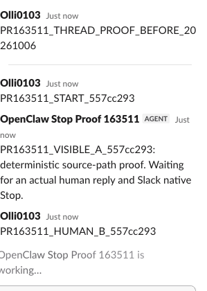
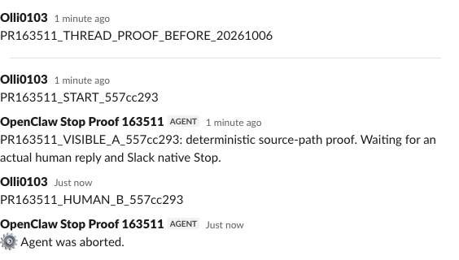
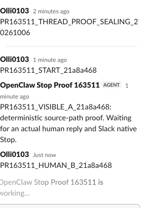
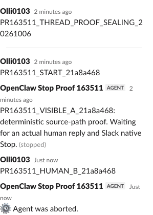

# Native Slack Stop proof for PR #163511 — 2026-10-06

Tested source: `51c771ef3d6c6047e12a1fbb2b1515515abaf753` (unchanged tracked source).
PR: https://github.com/openclaw/openclaw/pull/163511

**Result: both same-thread cells passed.** Real Slack Socket Mode and Web API transport, registered production ingress, streaming/rotation owners, native Stop authorization and original core `/stop` dispatcher. Only non-command reply output is deterministic through `channelRuntime.reply.dispatchReplyFromConfig`; B has deliberately silent fixture output. No production cancellation helper is called by the driver and no Slack event or response is fabricated.

The start request itself and human B are real threaded inbound messages with the same `message.thread_ts`. This matters: an outbound reply thread does not turn a top-level start request into threaded ingress. Earlier mismatched-scope setup runs were excluded, not counted as passing rotation proof.

## Correlated receipts

The JSON includes exact source-file digests, observed native event IDs/stream identities, sequential monotonic timestamps, parent-forwarder wire receipts and complete real provider readback. Wire receipts are task-forwarder observations, not Slack-side timing instrumentation.

| Cell | Before sealing | While the real sealing call is outstanding |
| --- | --- | --- |
| ID | `557cc293` | `21a8a468` |
| Thread | `1791279457.213529` | `1791279276.655369` |
| Native A stream | `1791279485.819219` | `1791279308.580329` |
| Human B event | `Ev0C6VPXHLCT` | `Ev0C75LUDMSQ` |
| Genuine Stop event | `Ev0C71S15J66` | `Ev0C75LW554L` |
| B boundary entered | sequence 73, 263766 ms | sequence 29, 133891 ms |
| Seal held before upstream | not invoked | sequence 37, 149900 ms |
| Stop admitted to original core | sequence 80, 265112 ms | sequence 43, 162695 ms |
| C dispatched / attempted | sequence 86, 275639 ms | sequence 35, 149895 ms |
| Original seal forwarded / returned | no application seal needed after native Stop | sequence 49 / 50, 173301 / 173617 ms, real Slack `ok:true` |
| Outcome | C settled without a write | C settled after seal completion without a write |

For each cell, there is exactly one forwarded `chat.startStream` (A), no wire request containing that cell's C, and no replacement native stream, progress, final or fallback. One real `chat.postMessage` carries the authorized Stop confirmation and is not answer C. Complete `conversations.replies` readback returned 5 messages in one page per thread: seed, start request, A, B, Stop confirmation. Both C markers are absent from text, blocks, attachments and other retained renderable representations.

[Sanitized native-event, wire and provider receipts](native-stop-receipts.json)

## Actual Slack UI

Screenshots are real decoded Slack captures. Only the task thread region is retained; sidebar and personal avatar column are cropped out. No UI/text/order has been reconstructed. Exact IDs correlate the images with the receipts; screenshots alone do not establish the race.

### Stop before sealing

Before the native Stop click:

After native Stop admission and release/settlement of C:

### Stop while sealing is outstanding

With the application's real `chat.stopStream` request held before upstream forwarding:

After genuine native Stop admission, forwarding the original held request to Slack and C settlement:

## Timing at this exact source head

A separate clean detached worktree used its own frozen lockfile installation, Node 24.19.0 and the pinned pnpm 12.5.1. Both changed test files ran with `--maxWorkers=1`.

| Run | Tests | Shell/process wall time |
| --- | ---: | ---: |
| Both changed test files together | 125 passed | 51.69 s (`/usr/bin/time -p`; Vitest 48.77 s) |
| `dispatch.preview-fallback.test.ts` alone | 95 passed | 19.725 s (completed compilation generation reused) |
| `delivery-trace.test.ts` alone | 30 passed | 13.011 s (completed compilation generation reused) |

Commands: `pnpm test extensions/slack/src/monitor/message-handler/dispatch.preview-fallback.test.ts extensions/slack/src/delivery-trace.test.ts --maxWorkers=1`; then each file separately with the same option to measure per-file process wall time. The individual timings are warm-generation runs, not independent cold-install times. Earlier maintainer 153-test validation is a separate run, not this 125-test measurement.

| Existing exact-head CI job | Result | Job wall seconds |
| --- | --- | ---: |
| [checks-node-changed-extensions-bundle-1](https://github.com/openclaw/openclaw/actions/runs/37361981861/job/111939266384) | success | 159 |
| [checks-node-changed](https://github.com/openclaw/openclaw/actions/runs/37361981861/job/111939266319) | success | 133 |
| [checks-node-changed-boundary](https://github.com/openclaw/openclaw/actions/runs/37361981861/job/111939266568) | success | 120 |

CI job seconds include setup and other steps and are not isolated test-file times. No CI dispatch was requested for this proof.

## Limits and cleanup

- This proves real Slack transport/native Stop with deterministic channel-boundary output, **not live-model cancellation**.
- Holding `chat.stopStream` before upstream forwarding proves an outstanding application sealing-call race, **not a request processing inside Slack's backend**. The held request is subsequently forwarded intact and receives a genuine Slack response.
- Browser control delays let the production typing status expire in the sealing cell. The task owner made one real `agents.sessions.setStatus(processing)` refresh to expose Slack's native Stop UI again. This is an explicit UI-status intervention, not a Stop/cancellation injection. It is retained among the wire receipts. The before-seal cell needed no manual status refresh.
- Test source/SDK imports came from the exact head; version-qualified third-party dependencies came from prepared local tooling. A separate isolated plugin registry, scheduler and state were used. Native Stop was delegated to the real core dispatcher.
- Isolated monitor/forwarder shutdown completed; no task listener/process remained. Production Gateway/configuration were not modified or restarted. The app and protected credentials remain available for later authorized tests.
- This evidence does not itself constitute maintainer acceptance, a merge, or a cleared bot verdict.
